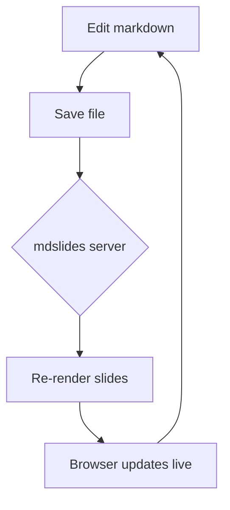
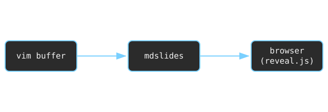
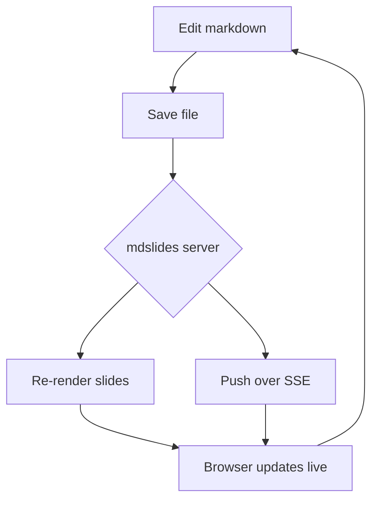

# mdslides

Turn any markdown file into a live slide deck.

Press `:P` to toggle the presentation.

## Why

- No context switching to a slide app
- Slides *are* the markdown file
- Live-updates as you edit

# Headings become slides

Any `#` heading starts a new slide. The deck is strictly linear -- just space / arrow-right to move forward, arrow-left to go back. There's no up/down grid to get lost in.

## Deeper headings are slides too

`##`, `###`, and every other heading level each start their own slide, same as `#`. There's no vertical nesting -- everything is just one slide after another.

# Content auto-fits the slide

If a slide's content is too big to fit, the whole thing -- text, images, diagrams -- shrinks down to fit. It never scrolls or gets cut off. This slide is deliberately packed to show it:

- reveal.js turns markdown into a browser presentation
- mdslides splits it into slides by heading, one after another
- a small local server pushes live updates over the network
- KaTeX renders any LaTeX math you write
- images resolve relative to the markdown file itself
- and none of that requires an internet connection to work

If it shrinks past readable, that's the signal to trim the slide's content -- mdslides won't do that part for you.

# Code blocks work too

```python
def greet(name):
    print(f"Hello, {name}!")

greet("world")
```

# Math with LaTeX

Inline math: the quadratic formula is $x = \frac{-b \pm \sqrt{b^2 - 4ac}}{2a}$.

Display math:

$$
\int_0^\infty e^{-x^2}\,dx = \frac{\sqrt{\pi}}{2}
$$

A few more:

- Euler's identity: $e^{i\pi} + 1 = 0$
- Sum notation: $\sum_{i=1}^n i = \frac{n(n+1)}{2}$

# Diagrams with Mermaid



# Images work too

Relative image paths resolve against the markdown file's own directory, just like a normal markdown previewer.




# A very long text slide

This slide exists to stress-test text-only auto-fit -- it should shrink down to fit entirely on one page, never scroll, and never get cut off, no matter how much is here.

- The quick brown fox jumps over the lazy dog near the riverbank at dawn.
- A small local server watches the markdown file and pushes live updates.
- Slides are just headings; there's no separate slide format to maintain.
- reveal.js handles all the presentation mechanics -- transitions, keys, layout.
- markdown-it converts the buffer's markdown into the HTML each slide renders.
- KaTeX renders LaTeX math entirely server-side, so no client math library lag.
- Mermaid renders diagrams client-side from fenced ` ```mermaid ` code blocks.
- highlight.js is vendored for syntax highlighting, though not wired in yet.
- Everything vendored in `app/vendor/` ships with the plugin -- no internet needed.
- Relative image paths resolve against the markdown file's own directory.
- The deck is strictly linear: space or arrow-right forward, arrow-left back.
- There's no grid navigation and no vertical slide stacks -- deliberately removed.
- Every heading level, `#` through `######`, starts its own new slide.
- Buffer edits are written to a tempfile and picked up by the server automatically.
- The browser side listens over server-sent events for live update pushes.
- Both Vim's `+job`/`+channel` and Neovim's `jobstart` are supported for spawning.
- `:MDSlidesStart`, `:MDSlidesStop`, and `:MDSlidesToggle` control the whole thing.
- If content still looks unreadably small once shrunk, that's a cue to trim it.
- Oversized content shrinking is uniform -- width and height scale by the same factor.
- None of this scaling ever changes the underlying markdown, just how it's displayed.

If you can read this comfortably, the content fit without much shrinking. If it's tiny, that's auto-fit doing its job on a deliberately overloaded slide.

# A very long mixed-content slide

Text, images, a mermaid diagram, and math formulae all crammed onto one slide, to check that auto-fit shrinks *everything* together and keeps it all on one page.

Inline math warms things up: $E = mc^2$, and the golden ratio $\varphi = \frac{1 + \sqrt{5}}{2}$, and a limit $\lim_{n \to \infty} \left(1 + \frac{1}{n}\right)^n = e$.

- First, some filler bullets to add bulk to the slide
- reveal.js, markdown-it, KaTeX, mermaid, and highlight.js are all vendored
- The server re-renders and pushes the whole deck on every save
- Auto-fit measures the unscaled content, then scales it down as one unit


More text between the images and the diagram, to mix things up further and add even more height to this already-tall slide.




And a closing display equation, just to make sure KaTeX block math also survives the shrink:

$$
\sum_{i=1}^n i^3 = \left( \frac{n(n+1)}{2} \right)^2
$$

That should be more than enough on one slide to force a noticeable shrink.

# Try editing me

Change this heading, add a bullet below, or add a brand new `#` slide -- watch the browser update without a manual refresh.

- edit
- save
- watch it update live

# Thanks!

That's the whole demo.
