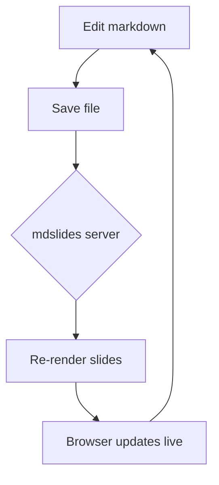
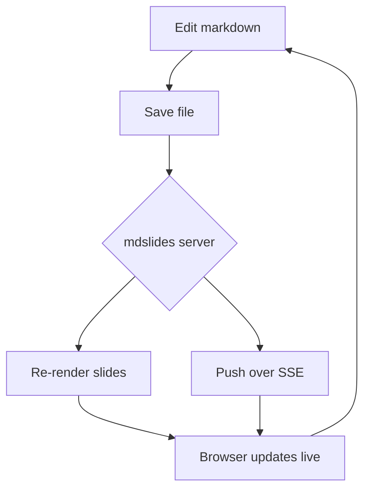
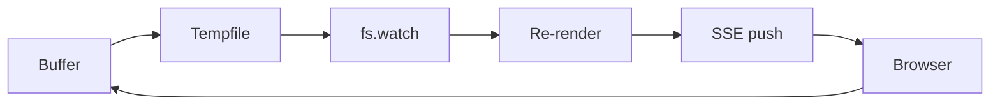

# mdslides

Turn any markdown file into a live slide deck.

Press `:P` to toggle the presentation.

## Why

- No context switching to a slide app
- Slides *are* the markdown file
- Live-updates as you edit

# Headings become slides

Any `#` heading starts a new slide. The deck is strictly linear -- just space / arrow-right to move forward, arrow-left to go back. There's no up/down grid to get lost in.

## Deeper headings are slides too

`##`, `###`, and every other heading level each start their own slide, same as `#`. There's no vertical nesting -- everything is just one slide after another.

# Content auto-fits the slide

If a slide's content is too big to fit, the whole thing -- text, images, diagrams -- shrinks down to fit. It never scrolls or gets cut off. This slide is deliberately packed to show it:

- reveal.js turns markdown into a browser presentation
- mdslides splits it into slides by heading, one after another
- a small local server pushes live updates over the network
- KaTeX renders any LaTeX math you write
- images resolve relative to the markdown file itself
- and none of that requires an internet connection to work

If it shrinks past readable, that's the signal to trim the slide's content -- mdslides won't do that part for you.

# Code blocks work too

```python
def greet(name):
    print(f"Hello, {name}!")

greet("world")
```

# Math with LaTeX

Inline math: the quadratic formula is $x = \frac{-b \pm \sqrt{b^2 - 4ac}}{2a}$.

Display math:

$$
\int_0^\infty e^{-x^2}\,dx = \frac{\sqrt{\pi}}{2}
$$

A few more:

- Euler's identity: $e^{i\pi} + 1 = 0$
- Sum notation: $\sum_{i=1}^n i = \frac{n(n+1)}{2}$

# Diagrams with Mermaid



# Images work too

Relative image paths resolve against the markdown file's own directory, just like a normal markdown previewer.


# A very long text slide

This slide exists to stress-test text-only auto-fit -- it should shrink down to fit entirely on one page, never scroll, and never get cut off, no matter how much is here.

- The quick brown fox jumps over the lazy dog near the riverbank at dawn.
- A small local server watches the markdown file and pushes live updates.
- Slides are just headings; there's no separate slide format to maintain.
- reveal.js handles all the presentation mechanics -- transitions, keys, layout.
- markdown-it converts the buffer's markdown into the HTML each slide renders.
- KaTeX renders LaTeX math entirely server-side, so no client math library lag.
- Mermaid renders diagrams client-side from fenced ` ```mermaid ` code blocks.
- highlight.js is vendored for syntax highlighting, though not wired in yet.
- Everything vendored in `app/vendor/` ships with the plugin -- no internet needed.
- Relative image paths resolve against the markdown file's own directory.
- The deck is strictly linear: space or arrow-right forward, arrow-left back.
- There's no grid navigation and no vertical slide stacks -- deliberately removed.
- Every heading level, `#` through `######`, starts its own new slide.
- Buffer edits are written to a tempfile and picked up by the server automatically.
- The browser side listens over server-sent events for live update pushes.
- Both Vim's `+job`/`+channel` and Neovim's `jobstart` are supported for spawning.
- `:MDSlidesStart`, `:MDSlidesStop`, and `:MDSlidesToggle` control the whole thing.
- If content still looks unreadably small once shrunk, that's a cue to trim it.
- Oversized content shrinking is uniform -- width and height scale by the same factor.
- None of this scaling ever changes the underlying markdown, just how it's displayed.
- The slide canvas now fills the browser viewport instead of a fixed 960x700 box.
- No npm dependencies are required -- `node` alone runs the whole server side.
- The plugin ships as `plugin/mdslides.vim` plus `autoload/mdslides.vim` for logic.
- `:MDSlidesStart` writes the current buffer to a tempfile before spawning the server.
- `TextChanged`, `TextChangedI`, `InsertLeave`, and `BufWritePost` all trigger a re-sync.
- Closing the buffer (`BufWipeout`) automatically stops the presentation and server.
- Each running presentation binds its own OS-assigned port, so several can run at once.
- The server watches the tempfile with `fs.watch` and debounces rapid successive saves.
- Server-sent events push the freshly rendered HTML straight into the open browser tab.
- `deck.sync()` reconciles reveal.js's internal state after the slide HTML is replaced.
- The current slide index is preserved across a live update, clamped to the new total.
- Images, mermaid diagrams, and math all get re-measured and re-fit after every update.
- `fitSlide()` always resets any prior transform before measuring, to avoid compounding scale.
- Only the currently visible slide needs to be measured, since others are display:none.
- A slide with very little content is simply shown at its natural size, never scaled up.
- The whole deck re-renders from the tempfile on every request to `/`, so it's always fresh.
- Vendored assets are served from `/vendor/`, scoped so requests can't escape that directory.
- Any other request path resolves relative to the markdown file's own directory instead.
- `SPECS.md` tracks which features are implemented, planned, or intentionally left out.
- `CLAUDE.md` documents the architecture and conventions for anyone (or anything) editing this repo.
- There's deliberately no build step -- edit `app/*.js` and reload the browser tab to see it.
- Vim's `job_start` uses `out_cb` for stdout; Neovim's `jobstart` uses `on_stdout` with a line list.
- Both code paths funnel into the same URL-parsing logic before opening the browser.
- `g:mdslides_open_browser_cmd` defaults per-platform: `open`, `start`, or `xdg-open`.
- A warning fires if the server hasn't reported its URL within four seconds of starting.
- `mdslides#stop()` is idempotent -- calling it when nothing is running is a harmless no-op.
- `mdslides#toggle()` just checks `s:is_running()` and calls start or stop accordingly.
- The tempfile name always ends in `.mdslides.md`, so it's still treated as markdown.
- `render.js` splits the buffer on headings first, then feeds each chunk to markdown-it.
- KaTeX errors are caught per-formula so one bad equation doesn't break the whole slide.
- Mermaid parse errors show inline in place of the diagram, rather than blanking the slide.
- The `#mdslides-status` indicator quietly reports connecting, live, or disconnected.
- Reconnection is automatic -- the browser's `EventSource` retries on its own if dropped.
- None of the vendored libraries phone home; everything renders fully offline.
- The plugin's own `job_status` / `jobwait` checks avoid double-spawning a server per buffer.
- Every one of these bullets is here only to make this the tallest slide in the deck.
- Sixty bullets, to be exact -- three times the original twenty this slide started with.
- If you're still reading, the shrink is doing exactly what it's supposed to do.
- (Yes, this parenthetical bullet counts too -- it's still one line in the list.)
- And that's the last bullet -- point being, there's a lot of it, on purpose.

If you can read this comfortably, the content fit without much shrinking. If it's tiny, that's auto-fit doing its job on a deliberately overloaded slide.

# A very long mixed-content slide

Text, images, a mermaid diagram, and math formulae all crammed onto one slide, to check that auto-fit shrinks *everything* together and keeps it all on one page.

Inline math warms things up: $E = mc^2$, and the golden ratio $\varphi = \frac{1 + \sqrt{5}}{2}$, and a limit $\lim_{n \to \infty} \left(1 + \frac{1}{n}\right)^n = e$.

- First, some filler bullets to add bulk to the slide
- reveal.js, markdown-it, KaTeX, mermaid, and highlight.js are all vendored
- The server re-renders and pushes the whole deck on every save
- Auto-fit measures the unscaled content, then scales it down as one unit
- The scale factor is uniform, so aspect ratio never distorts while shrinking
- Text, images, and diagrams all live inside the same `.slide-fit` wrapper
- That wrapper is what actually gets the CSS `transform: scale(...)` applied
- Measuring happens with the transform reset to `none`, to get the true size
- Only the currently-visible slide needs measuring; others are `display:none`
- Images that haven't finished loading yet trigger a re-fit once they do
- Mermaid diagrams are rendered, then the slide is re-fit to their real size
- This is bullet twelve of this list -- four times as many as the original


More text between the images and the diagram, to mix things up further and add even more height to this already-tall slide.




A second equation before the halfway point, to make sure back-to-back display math doesn't trip up the fit measurement:

$$
\varphi^2 = \varphi + 1
$$

And here's the whole cycle again -- another image, more text, another diagram, and another equation -- just to really pile on the height:


Yet more text between this second round of images and diagrams, reinforcing that auto-fit has to handle repeated, not just varied, content without losing track of the true scroll height.




And a closing display equation, just to make sure KaTeX block math also survives the shrink:

$$
\sum_{i=1}^n i^3 = \left( \frac{n(n+1)}{2} \right)^2
$$

That should be more than enough on one slide to force a noticeable shrink.

# Try editing me

Change this heading, add a bullet below, or add a brand new `#` slide -- watch the browser update without a manual refresh.

- edit
- save
- watch it update live

# Thanks!

That's the whole demo.
