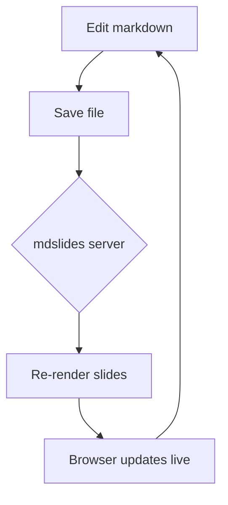

# mdslides

Turn any markdown file into a live slide deck.

Press `:P` to toggle the presentation.

## Why

- No context switching to a slide app
- Slides *are* the markdown file
- Live-updates as you edit

# Headings become slides

Any `#` heading starts a new slide. The deck is strictly
linear -- just space / arrow-right to move forward, arrow-left
to go back. There's no up/down grid to get lost in.

## Deeper headings are slides too

`##`, `###`, and every other heading level each start their own
slide, same as `#`. There's no vertical nesting -- everything is
just one slide after another.

# Content auto-fits the slide

If a slide's content is too big to fit, the whole thing --
text, images, diagrams -- shrinks down to fit. It never scrolls
or gets cut off. This slide is deliberately packed to show it:

- reveal.js turns markdown into a browser presentation
- mdslides splits it into slides by heading, one after another
- a small local server pushes live updates over the network
- KaTeX renders any LaTeX math you write
- images resolve relative to the markdown file itself
- and none of that requires an internet connection to work

If it shrinks past readable, that's the signal to trim the
slide's content -- mdslides won't do that part for you.

# Code blocks work too

```python
def greet(name):
    print(f"Hello, {name}!")

greet("world")
```

# Math with LaTeX

Inline math: the quadratic formula is $x = \frac{-b \pm \sqrt{b^2 - 4ac}}{2a}$.

Display math:

$$
\int_0^\infty e^{-x^2}\,dx = \frac{\sqrt{\pi}}{2}
$$

A few more:

- Euler's identity: $e^{i\pi} + 1 = 0$
- Sum notation: $\sum_{i=1}^n i = \frac{n(n+1)}{2}$

# Diagrams with Mermaid



# Images work too

Relative image paths resolve against the markdown file's own
directory, just like a normal markdown previewer.


# Try editing me

Change this heading, add a bullet below, or add a
brand new `#` slide -- watch the browser update without
a manual refresh.

- edit
- save
- watch it update live

# Thanks!

That's the whole demo.
