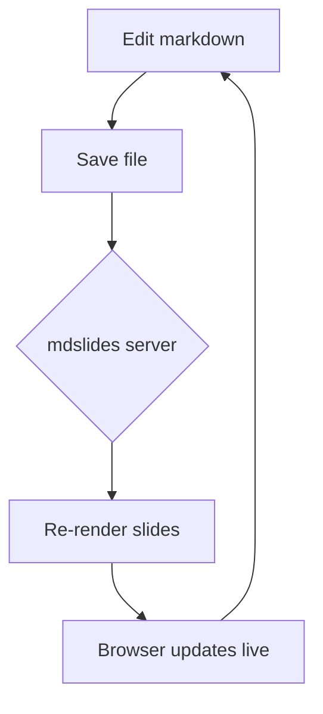

# mdslides

Turn any markdown file into a live slide deck.

Press `:P` to toggle the presentation.

## Why

- No context switching to a slide app
- Slides *are* the markdown file
- Live-updates as you edit

# Headings become slides

Any `#` heading starts a new slide.

## This is a sub-slide

Deeper headings (`##`, `###`, ...) become vertical
sub-slides nested under the last top-level slide.

## Another sub-slide

Press `j`/`down` in the browser to move between these.

# Code blocks work too

```python
def greet(name):
    print(f"Hello, {name}!")

greet("world")
```

# Math with LaTeX

Inline math: the quadratic formula is $x = \frac{-b \pm \sqrt{b^2 - 4ac}}{2a}$.

Display math:

$$
\int_0^\infty e^{-x^2}\,dx = \frac{\sqrt{\pi}}{2}
$$

A few more:

- Euler's identity: $e^{i\pi} + 1 = 0$
- Sum notation: $\sum_{i=1}^n i = \frac{n(n+1)}{2}$

# Diagrams with Mermaid



# Images work too

Relative image paths resolve against the markdown file's own
directory, just like a normal markdown previewer.


## Another image, on its own sub-slide


# Try editing me

Change this heading, add a bullet below, or add a
brand new `#` slide -- watch the browser update without
a manual refresh.

- edit
- save
- watch it update live

# Thanks!

That's the whole demo.
